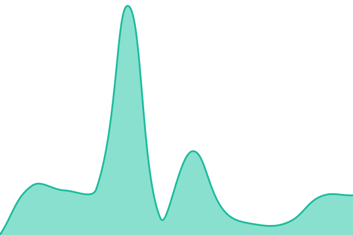

# [📈 Live Status](https://demo.upptime.js.org): <!--live status--> **所有系统正常运行**

This repository contains the open-source uptime monitor and status page for [SCP Miraheze CN](https://demo.upptime.js.org), powered by [Upptime](https://github.com/upptime/upptime).

With [Upptime](https://upptime.js.org), you can get your own unlimited and free uptime monitor and status page, powered entirely by a GitHub repository. We use [Issues](https://github.com/scpzh/upptime-for-scpzh/issues) as incident reports, [Actions](https://github.com/scpzh/upptime-for-scpzh/actions) as uptime monitors, and [Pages](https://status.scpzh.org/) for the status page.

<!--start: status pages-->
<!-- This summary is generated by Upptime (https://github.com/upptime/upptime) -->
<!-- Do not edit this manually, your changes will be overwritten -->
<!-- prettier-ignore -->
| URL | Status | History | Response Time | Uptime |
| --- | ------ | ------- | ------------- | ------ |
|  [SCP Miraheze CN Wiki](https://scpfoundation.miraheze.org) | 正常 | [scp-miraheze-cn-wiki.yml](https://github.com/scpzh/upptime-for-scpzh/commits/HEAD/history/scp-miraheze-cn-wiki.yml) | 

 1149毫秒
     
 | 

<a href="https://status.scpzh.org/history/scp-miraheze-cn-wiki">99.68%</a>
    

|  [SCP Miraheze CN Forum](https://forum.scpzh.org/) | 正常 | [scp-miraheze-cn-forum.yml](https://github.com/scpzh/upptime-for-scpzh/commits/HEAD/history/scp-miraheze-cn-forum.yml) | 

 786毫秒
     
 | 

<a href="https://status.scpzh.org/history/scp-miraheze-cn-forum">100.00%</a>
    

|  [Cloudflare](https://www.cloudflarestatus.com/api/v2/status.json) | 正常 | [cloudflare.yml](https://github.com/scpzh/upptime-for-scpzh/commits/HEAD/history/cloudflare.yml) | 

 152毫秒
     
 | 

<a href="https://status.scpzh.org/history/cloudflare">99.77%</a>
    

|  [GitHub](https://github.com) | 正常 | [git-hub.yml](https://github.com/scpzh/upptime-for-scpzh/commits/HEAD/history/git-hub.yml) | 

 241毫秒
     
 | 

<a href="https://status.scpzh.org/history/git-hub">100.00%</a>
    

|  [Wikidot](https://www.wikidot.com) | 正常 | [wikidot.yml](https://github.com/scpzh/upptime-for-scpzh/commits/HEAD/history/wikidot.yml) | 

 225毫秒
     
 | 

<a href="https://status.scpzh.org/history/wikidot">100.00%</a>
    

<!--end: status pages-->

[**Visit our status website →**](https://status.scpzh.org/)

## 📄 License

- Powered by: [Upptime](https://github.com/upptime/upptime)
- Code: [MIT](./LICENSE) © [Anand Chowdhary](https://anandchowdhary.com)
- Data in the `./history` directory: [Open Database License](https://opendatacommons.org/licenses/odbl/1-0/)
